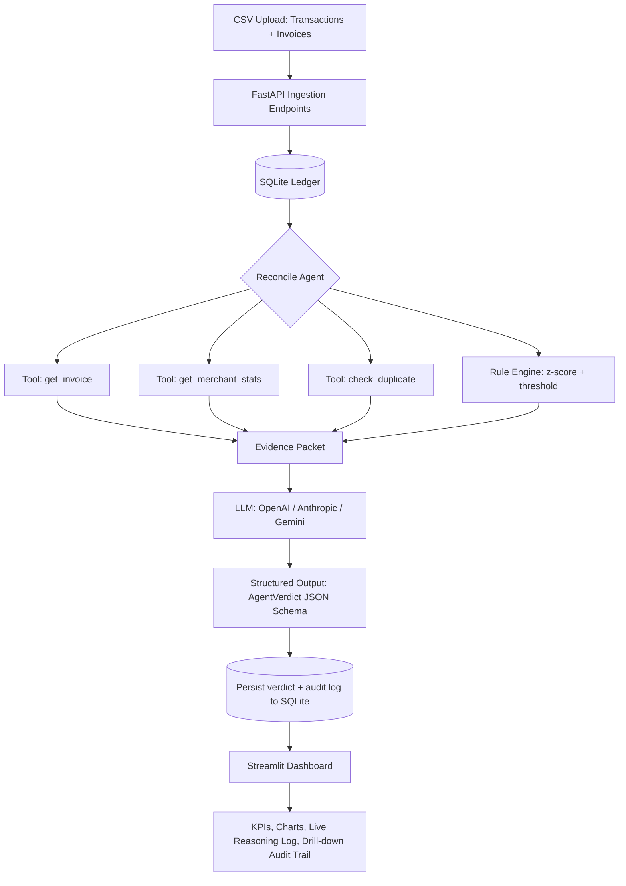

# 💳 ReconcileAI — AI Finance Controller

**Track 4: AI Finance Controller / AI Risk & Fraud Detection**
Submission for the Razorpay AI Builder Internship

An agentic system that autonomously reconciles payment transactions against invoices and flags anomalies (fraud, duplicate charges, statistical outliers, mismatched billing) — with every verdict backed by a transparent, tool-grounded reasoning trail instead of an opaque LLM guess.

---

## 1. Problem Statement

Payment companies process ledgers where three things constantly go wrong at scale:

1. **Invoice mismatches** — the amount charged doesn't match what was billed (partial refunds, pricing bugs, manual entry errors).
2. **Missing reconciliation** — a transaction exists with no corresponding invoice record, or vice versa.
3. **Anomalous / fraudulent activity** — duplicate charges fired seconds apart, a merchant's ticket size suddenly spiking 20x, or rapid charge→refund loops consistent with card-testing fraud.

Today this is either done manually by finance analysts (slow, doesn't scale) or with static rule engines (rigid, high false-positive rate, no natural-language explanation for auditors). **ReconcileAI** combines deterministic rule/statistics engines (for facts and math an LLM shouldn't be trusted with) with an LLM reasoning layer (for judgment and natural-language explanation), producing an auditable, schema-validated verdict per transaction.

---

## 2. Core Agentic Workflow

The agent does **not** ask the LLM to "figure out" reconciliation from raw data. It gathers evidence first via deterministic tools, then asks the LLM to weigh that evidence and return a structured verdict. This is the single most important design decision in the project (see Technical Obstacles below).



**Per-transaction tool-calling sequence:**

| Step | Tool / Component | Purpose |
|---|---|---|
| 1 | `get_invoice()` | Deterministic DB lookup — ground-truth billed amount |
| 2 | `get_merchant_stats()` | Computes mean/stdev of merchant's transaction history |
| 3 | `check_duplicate()` | Scans a ±10 minute window for repeat charges |
| 4 | Rule engine | Computes z-score of the amount vs. merchant baseline |
| 5 | LLM (structured output) | Weighs all evidence, returns `AgentVerdict` (reconciliation status, anomaly flag, risk score 0-100, cited reasoning, recommended action) |
| 6 | Persistence | Verdict + full tool-call trace written to `analysis_log` for audit |

---

## 3. Folder Structure

```
ai-finance-controller/
├── backend/
│   ├── main.py            # FastAPI app & all endpoints
│   ├── agent.py           # ReconcileAgent — tools + LLM structured-output logic
│   ├── llm_utils.py        # Provider-agnostic LLM client (OpenAI/Anthropic/Gemini)
│   ├── database.py         # SQLAlchemy models + SQLite session
│   ├── schemas.py          # Pydantic request/response + AgentVerdict contract
│   └── config.py            # Env-driven settings
├── frontend/
│   └── app.py              # Streamlit UI (upload, run analysis, dashboard)
├── scripts/
│   └── generate_synthetic_data.py   # Synthetic ledger generator
├── data/
│   ├── transactions.csv    # Pre-generated sample data (500+ rows)
│   └── invoices.csv
├── requirements.txt
├── .env.example
├── video_script.md
└── README.md
```

---

## 4. Setup Instructions

```bash
# 1. Clone and enter the project
cd ai-finance-controller

# 2. Create a virtual environment
python -m venv venv
source venv/bin/activate        # Windows: venv\Scripts\activate

# 3. Install dependencies
pip install -r requirements.txt

# 4. Configure your LLM key
cp .env.example .env
# edit .env and set ONE of: OPENAI_API_KEY / ANTHROPIC_API_KEY / GEMINI_API_KEY

# 5. (Optional) regenerate synthetic data — sample CSVs are already in /data
cd scripts && python generate_synthetic_data.py --n 500 --out ../data && cd ..

# 6. Start the backend
cd backend
uvicorn main:app --reload --port 8000

# 7. In a second terminal, start the frontend
cd frontend
streamlit run app.py
```

Open the Streamlit URL (usually `http://localhost:8501`), upload `data/transactions.csv` and `data/invoices.csv` in the **Upload & Ingest** tab, then hit **Run Analysis** in the second tab.

---

## 5. API Documentation

Interactive Swagger docs are auto-generated at `http://localhost:8000/docs` once the backend is running. Summary:

| Method | Endpoint | Description |
|---|---|---|
| `GET` | `/health` | Liveness check; reports which LLM provider is active |
| `POST` | `/ingest/transactions` | Bulk-insert transactions from a JSON array |
| `POST` | `/ingest/transactions/csv` | Ingest transactions from raw CSV text (body: `{"csv_text": "..."}`) |
| `POST` | `/ingest/invoices/csv` | Ingest invoices from raw CSV text |
| `POST` | `/analyze` | Runs the ReconcileAgent over unreviewed transactions. Body: `{"merchant_id": optional, "limit": int}` |
| `GET` | `/transactions` | List/filter transactions (`merchant_id`, `anomalies_only`, `status`, `limit`) |
| `GET` | `/transactions/{transaction_id}/logs` | Full tool-call + reasoning audit trail for one transaction |
| `GET` | `/stats/summary` | Aggregate KPIs for the dashboard |

**Example — trigger analysis:**
```bash
curl -X POST http://localhost:8000/analyze \
  -H "Content-Type: application/json" \
  -d '{"limit": 25}'
```

**Example verdict object (`AgentVerdict`):**
```json
{
  "transaction_id": "TXN4F2A9C1B3D",
  "reconciliation_status": "MISMATCHED",
  "is_anomaly": true,
  "risk_score": 62.0,
  "reasoning": "Invoice INV8A3C1D22 was billed at ₹4,200 but the transaction charged ₹5,460 (30% higher), and the amount is 2.1 standard deviations above this merchant's typical ticket size.",
  "recommended_action": "Hold payout and request merchant clarification on the amount discrepancy."
}
```

---

## 6. Key Features

- **Multi-provider LLM support** — auto-detects whichever of OpenAI / Anthropic / Gemini has a key configured; zero code changes needed to switch.
- **Tool-grounded agentic reasoning** — the LLM never invents numbers; every fact (invoice amount, merchant baseline, duplicate count) comes from a deterministic Python tool call it's shown before answering.
- **Schema-enforced output** — verdicts are returned via LangChain structured output bound to a Pydantic model, so malformed or partial JSON simply cannot reach the database.
- **Full audit trail** — every tool call and the final verdict are logged per transaction and viewable in the dashboard, which matters for a compliance-heavy domain like payments.
- **Realistic synthetic data generator** — seeds six discrepancy patterns (matched, mismatched, missing invoice, duplicate, statistical outlier, refund-fraud loop) so the demo has real things to catch.
- **Interactive dashboard** — KPIs, reconciliation-status breakdown, risk-score distribution, and a searchable per-transaction audit drill-down.

---

## 7. Technical Obstacles & How They Were Resolved

**1. Hallucination risk (LLM inventing amounts or fabricating invoice matches)**
Resolved by inverting the responsibility: all arithmetic (z-scores, averages) and all database lookups (invoice matching, duplicate detection) are done in plain deterministic Python *before* the LLM is called. The model only ever sees pre-computed evidence and is instructed to cite it — it is never asked to compute or recall a number itself.

**2. Unstructured/inconsistent LLM output breaking downstream code**
Resolved using LangChain's `with_structured_output()` bound to a strict Pydantic schema (`AgentVerdict`) with a `Literal` type on `reconciliation_status`. The model physically cannot return a response that fails validation — it's forced through function-calling, not text parsing with regex.

**3. Vendor lock-in / judges may only have one of three possible API keys**
Resolved with a provider-agnostic `llm_utils.get_chat_model()` that inspects which environment variable is set and returns the matching LangChain chat model, so `agent.py` never imports a specific vendor SDK.

**4. Latency & transient API failures during batch analysis**
Resolved with `tenacity`-based exponential backoff retries (3 attempts) around every LLM call, plus a low `temperature=0.0` to reduce variance and re-generation overhead. Batches are processed transaction-by-transaction with logging, so a single failure doesn't lose the rest of the batch's results.

**5. Large CSV payloads breaking on query-string length limits**
Initially the CSV ingestion endpoints accepted `csv_text` as a query parameter; with real ledgers (tens of thousands of rows) this silently truncates. Moved to a JSON request body (`CsvPayload` model) instead.

**6. Giving auditors a "why," not just a "what"**
A pure classifier (fraud / not fraud) isn't useful to a finance controller who has to justify a decision. Every verdict carries a `reasoning` field the LLM is required to ground in the specific evidence it was shown, plus a full machine-readable tool-call log per transaction surfaced in the dashboard's drill-down view.

---

## 8. Future Scope

- Real-time streaming ingestion (Kafka/webhook) instead of batch CSV upload.
- PDF invoice parsing (OCR + LLM extraction) for merchants who don't provide structured invoice feeds.
- A feedback loop where analyst overrides of a verdict fine-tune the rule-engine thresholds over time.
- Multi-agent handoff: a separate "Dispute Resolution Agent" that drafts merchant communication for flagged cases.
- Role-based access control and SOC2-aligned audit export (CSV/PDF) of the full reasoning log.
